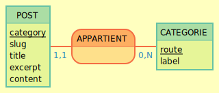

## Entrée
POST: category, slug, title, excerpt,content   
APPARTIENT, 0N CATEGORIE, 11 POST  
CATEGORIE: route, label

## Image du MCD

We need to create 2 table, one that will contain the posts and the other for the categories

## Routes

### GET
- "/categories" return all categories 
- "/posts"  return all posts
- "/posts/category/:id" return 
- "/posts/:id"

### POST
- "posts" add an article

## Migration

We have to import json data file into our bdd using a custom js file.